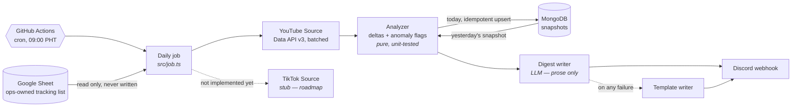

# Campaign Video Performance Tracker

Every morning at 09:00 Manila time — [both the time and the timezone are
configurable](#scheduling) — this posts a plain-English summary of how every
creator video in every live campaign performed yesterday, and flags the ones a
human should actually look at, into Discord.

---

## The problem

When a campaign is running, someone on ops has to know how the creator videos
are doing. Today that means opening each link, copying the view count into a
sheet, comparing it against what it said yesterday, and noticing by eye that one
video has taken off and another has quietly died. With a few dozen videos across
a few campaigns, that is a genuine chunk of a morning, every morning, and it is
the kind of task where the important thing — *that one video is suddenly doing
5× its normal numbers* — is the thing most easily missed while doing the boring
part.

This does the boring part on a schedule and says the important part out loud.

## What it does

Once a day it reads the tracking sheet ops already maintains, fetches yesterday's
numbers for every video, compares them against the last time it looked, records
today's numbers, decides which changes are worth a human's attention, writes a
short summary in plain English, and posts it to Discord — along with a list of
anything in the sheet that needs fixing.

It is designed so that nothing in that chain can fail silently, and so that one
broken video, one bad row, or one platform outage never costs you the rest of
the report.

## Architecture



### The three decisions worth knowing about

**A Google Sheet is the input, not a web UI.** Ops already lives in Sheets. A
bespoke internal tool is one more thing to log into, and internal tools nobody
logs into quietly rot. The tradeoff is that there is no validation at entry
time — so validation happens on read, and every rejected row is reported back in
the Discord message, naming the row number to fix. Feedback lands where ops
already looks.

**The job never writes to the sheet.** If it did, a job write and a human edit
could land at the same moment and the human would silently lose their row. The
sheet is the source of truth for *what to track*; Mongo is the source of truth
for *history*. Those two never overlap, so they can never disagree.

**The LLM never touches a number.** Every figure, every comparison, and every
anomaly decision is computed in [`src/analyze.ts`](src/analyze.ts) —
deterministically, in pure functions, under unit test. The model receives an
object that is already correct and its only job is to phrase it. That is why the
fallback is honest rather than embarrassing: if the model call fails, a template
renders the same facts from the same object, and the report still goes out with
identical numbers.

### Main components

| File | What it does |
|---|---|
| [`src/job.ts`](src/job.ts) | Orchestrates the pipeline. Owns the error philosophy. |
| [`src/inputs/sheet.ts`](src/inputs/sheet.ts) | Reads the tracking sheet; turns bad rows into warnings. |
| [`src/inputs/urls.ts`](src/inputs/urls.ts) | Pure URL parsing. One of two places untrusted input enters. |
| [`src/sources/youtube.ts`](src/sources/youtube.ts) | YouTube Data API v3, batched 50 ids per call. |
| [`src/sources/tiktok.ts`](src/sources/tiktok.ts) | Documented stub. Explains the tradeoff and the plan. |
| [`src/analyze.ts`](src/analyze.ts) | **The only module that decides anything.** Pure, tested. |
| [`src/rules.ts`](src/rules.ts) | The thresholds, in one place, tunable without touching logic. |
| [`src/storage.ts`](src/storage.ts) | Mongo snapshots + an in-memory twin for dry runs. |
| [`src/digest.ts`](src/digest.ts) | LLM prose with a deterministic template fallback. |
| [`src/notifiers/discord.ts`](src/notifiers/discord.ts) | Builds and posts the embed. |

`Source` and `Notifier` are the extension points. Instagram becomes another
`Source`; Slack becomes another `Notifier`. Both interfaces have exactly one
method, deliberately — there are two platforms and one channel, and a plugin
framework with registration and lifecycle hooks would be more impressive and
less useful.

---

## Running it

### See it work right now — no credentials, no database, no network

```bash
npm install
npm run job:dry
```

That runs the **entire** pipeline against fixture data and prints the exact
Discord payload it would have posted. The fixtures go through the same
validation and the same response parser as the live path, and they deliberately
cover a spike, a stall, ordinary growth, a deleted video, a video with hidden
statistics, a brand-new video, a pending TikTok link, and three rows that should
be rejected.

```bash
npm test          # 44 tests
npm run typecheck
npm run check:env # validates .env offline once you have credentials
```

### Running it for real

1. **Create the tracking sheet.** Import [`docs/Tracked.csv`](docs/Tracked.csv)
   into a new Google Sheet via **File → Import → Insert new sheet(s)**; the tab
   lands named `Tracked`, which is the range the job reads. Ops adds a row per
   video from then on — video URL, campaign, creator — and nothing else is
   asked of them.

2. **Set up credentials.** `cp .env.example .env` and fill it in.
   **[`docs/setup.md`](docs/setup.md) is a click-by-click walkthrough** of all
   five, written for someone who has never opened Google Cloud or Atlas — it
   covers the step everyone misses (sharing the sheet with the service account)
   and has a troubleshooting table for the errors whose messages don't say what
   is actually wrong.

3. **Run it.**

   ```bash
   npm run job
   ```

### Scheduling

There are **two separate knobs**, and it's worth knowing why they aren't one:

| Knob | Where | Controls |
|---|---|---|
| `TIMEZONE` | `.env` | Which calendar day a run is recorded against, and the date on the report |
| `cron` | [`.github/workflows/daily.yml`](.github/workflows/daily.yml) | What time the job actually fires |

The firing time can't live in `.env`, because GitHub parses the `on: schedule:`
block before any environment exists. The workflow file has a conversion table in
its comments — the rule is `UTC hour = local hour − that zone's UTC offset`, so
09:00 in Manila (UTC+8) is `0 1 * * *`.

`TIMEZONE` accepts any IANA zone name and is validated at startup, so a typo
fails immediately with an explanation instead of quietly filing every snapshot
under the wrong day. The job logs which zone it resolved:

```
[job] starting run for 2026-08-11 — Asia/Manila (UTC+8, local time 09:00)
```

Runs can also be triggered by hand from the Actions tab (`workflow_dispatch`),
which is how you test without waiting for tomorrow. Secrets use the same names
as `.env`. A failed run exits non-zero and shows up red.

Tests run before the pipeline in CI: it costs 400ms and means we never post
numbers produced by broken logic.

> Two caveats worth knowing: GitHub's cron has no DST awareness, so zones that
> observe DST drift by an hour twice a year (Manila doesn't, which is one reason
> it's a clean default); and scheduled runs can be delayed under GitHub load.
> Neither matters for a daily digest, but don't build anything time-critical on
> this scheduler.

---

## Stack and dependencies

TypeScript on Node 22, run directly with `tsx` — no build step. Vitest for tests.

Three runtime dependencies, and each one earns its place:

| Dependency | Why |
|---|---|
| `mongodb` | Official driver. Snapshot history needs a real datastore with a unique index. |
| `google-auth-library` | Service-account JWTs are RS256-signed. Hand-rolling that is a bad idea. |
| `dotenv` | Local `.env` loading. |

Everything else talks HTTP over native `fetch`: four APIs, four fetch calls. The
full `googleapis` package would have been ~50MB of transitive surface for a
single `spreadsheets.values.get`.

---

## Assumptions I made

1. **YouTube first.** TikTok has no free official API for public video stats, so
   TikTok links are validated and reported as pending rather than ingested.
   [`src/sources/tiktok.ts`](src/sources/tiktok.ts) has the full reasoning.
2. **Daily granularity is enough.** Ops reviews this in the morning; hourly
   polling would multiply cost and quota for a number nobody acts on faster.
3. **Internal and trusted.** No auth on anything. The sheet is shared with the
   team, the Discord channel is internal, and the job runs in CI.
4. **The sheet is the source of truth for what to track.** Deleting a row stops
   tracking; history for that video stays in Mongo.
5. **View count is the primary metric.** Likes and comments are recorded and
   reported, but anomaly detection keys on views. Creators can hide likes
   independently, so treating them as primary would produce phantom alerts.
6. **The thresholds in `rules.ts` are starting guesses**, not calibrated against
   real campaign data. See the honesty note below.

## Questions I would have asked

The brief said to note anything whose answer would genuinely have changed the
build. Three would have:

1. **"Who reads this, and what do they do differently because of it?"** I built
   a daily anomaly alert. If the real need is end-of-campaign reporting to
   clients, this should be a weekly rollup and the anomaly detection is largely
   wasted work.
2. **"Do campaigns already live in Monday.com?"** I assumed a Sheet. If Monday
   is already the system of record, then building on a Sheet creates a second
   list that drifts from the first, and the right build is a Monday integration.
3. **"What is the actual TikTok/YouTube split?"** I built YouTube first because
   it has a clean free API. If the real mix is 80% TikTok, I built the wrong
   half and the entire budget should have gone into the scraping problem
   instead.

## What I deliberately left out

A web UI, auth, retry/queue infrastructure, TikTok scraping, Slack, historical
charts, Docker, and tests on anything that is pure I/O. Tests cover
[`analyze.ts`](src/analyze.ts) (the only module that decides anything),
[`urls.ts`](src/inputs/urls.ts) (where untrusted input enters), and the storage
contract. Everything else would have needed mocking into meaninglessness.

## What I would build next

1. **A heartbeat.** The most important missing piece — see below.
2. **TikTok ingestion**, almost certainly by buying a data provider rather than
   maintaining scrapers. At agency scale the cost is a rounding error against an
   engineer-day a month of unblocking them.
3. **Threshold calibration** against two weeks of real data, replacing my guesses.
4. **Per-campaign routing**, so each campaign's digest goes to its own channel.
5. **Batched snapshot lookups.** Currently one query per video; fine at a few
   hundred, worth fixing before a few thousand.

## Running this in production

Secrets would move out of Actions into whatever the company already uses, and
I'd add automated secret scanning to CI — a placeholder connection string in
these docs was enough to trip GitGuardian, which is exactly the sort of alert
that gets muted if it fires on things that aren't real. Examples in the setup
guide are now structurally invalid so a scanner can tell them apart from the
real thing. The
job itself is a single command, so it runs equally well as a systemd timer on
the VPS if scheduling should not depend on GitHub. First things to monitor, in
order:

1. **Age of the last successful run.** Everything else is secondary.
2. **The AI fallback rate.** The embed footer says which writer produced the
   summary; if it reads "template" for a week, the model calls are failing and
   the report still arrives every morning looking fine.
3. Counts of unavailable / hidden / skipped rows per run — a jump usually means
   something changed upstream, not that ten creators deleted their videos.
4. YouTube API error rate.

### What would make me uncomfortable about shipping this today

**Silent failure is indistinguishable from a quiet day.** If the cron breaks —
or if GitHub disables the schedule, which it does for repositories that go quiet
for 60 days — nobody finds out, because a missing digest looks exactly like a
morning with no news. The system has no heartbeat, and the watcher has no
watcher. This is the first thing I would fix.

**Nothing validates the AI's prose against the numbers.** The template fallback
protects against the model being *unavailable*, not against it being *wrong*.
Ops may well paste a sentence from this into a client update. I would add an
assertion that every figure appearing in the generated text also appears in the
computed stats, and fall back to the template if it does not.

**The thresholds are guesses.** I picked +50% and a 100-view floor without ever
seeing real campaign data. If they are badly calibrated, ops stops trusting the
alerts within two weeks — and a distrusted alert is worse than no alert at all.

---

## Also in this repo

- **[`docs/setup.md`](docs/setup.md)** — click-by-click credential setup and a
  troubleshooting table.
- **[`docs/self-review.md`](docs/self-review.md)** — what's strong, what's weak,
  the alternative I rejected, and what would worry me in production.
- **[`docs/handover.md`](docs/handover.md)** — the message I'd post to the tech
  channel.

## How AI was used

Honestly, and specifically:

- **Architecture, scoping, and every judgment call in this README are mine.**
  The decision to cut the web UI in favour of a Sheet, the Source/Notifier
  boundaries, keeping the model away from the arithmetic, and what to leave out
  were the actual work.
- **I used Claude heavily as an implementation partner** — drafting modules
  against my structure, writing test cases around rules I specified, and talking
  through tradeoffs. It is genuinely faster at turning a decided design into
  typed code than I am.
- **Two things it got wrong that mattered**, both caught by reading output
  rather than reading code:
  - The first anomaly rules were percentage-only. A video going from 4 to 7
    views is a "+75% spike", and a stall rule based on *state* rather than
    *transition* re-alerts on every finished video every morning forever. Both
    would have made the digest noise within a week. Fixed with an absolute
    floor and transition detection — that is what the two "does NOT flag" tests
    in [`tests/analyze.test.ts`](tests/analyze.test.ts) exist to protect.
  - The first version reported a deleted video as `(untitled) — no longer
    viewable`, because the API returns no title for a video that is gone. I
    only noticed by running the dry run and reading it as an ops person would.
    The title is now carried forward from the last snapshot that had one.
- **The LLM inside the product** does exactly one thing: turn a verified object
  into a sentence. It never calculates, and if it is unavailable the report
  still goes out. That boundary was a deliberate design choice, not a
  limitation I ran into.
